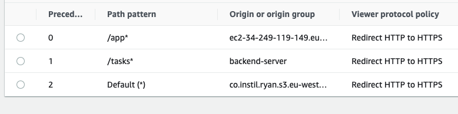

# Getting it into Cloudfront

You need to create two origins, one for your restapi and one for your website. They will have the domain name of your EC2 instance and the appropriate port number (80 for nginx and [for me] 8000 for the restapi).

Then you'll need to create behaviours that point specific requests to those origins.

Here's a picture…

The * is required in the path pattern to match all paths below the relevant directory.

The config of the behaviours are almost just the defaults, except that for the RestApi you'll need to enable all HTTP Verbs (get, post, put, delete, patch, options, head) rather than just get and head. And you'll likely need to disable caching (at least I did, so I don't need to think about it in this exercise).
